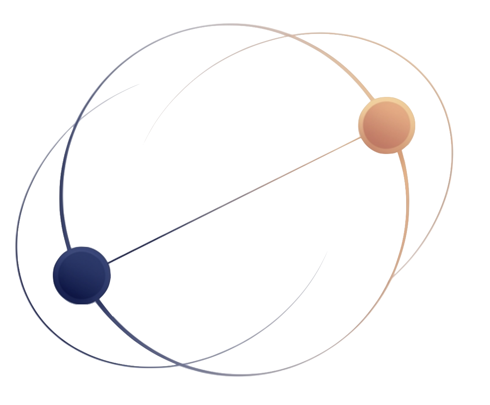

<div align="center">



# Galaxy Eye

### Suite de Terapia Visual Interactiva con Seguimiento Ocular

[](https://unity.com/)
[](https://docs.unity3d.com/Packages/com.unity.render-pipelines.universal@latest)
[](https://www.microsoft.com/windows)
[](https://docs.microsoft.com/dotnet/csharp/)
[](LICENSE)
[](https://www.ual.es/)

*Proyecto académico · Grado en Ingeniería Informática · Universidad de Almería · 2026*

</div>

---

## 📋 Tabla de Contenidos

- [Descripción](#-descripción)
- [Actividades](#-actividades)
- [Tecnologías](#-tecnologías)
- [Requisitos del sistema](#%EF%B8%8F-requisitos-del-sistema)
- [Instalación](#%EF%B8%8F-instalación-y-puesta-en-marcha)
- [Estructura del proyecto](#-estructura-del-proyecto)
- [Pruebas automáticas](#-pruebas-automáticas)
- [Arquitectura](#%EF%B8%8F-arquitectura)
- [Autores](#-autores)
- [Licencia](#-licencia)

---

## 🌌 Descripción

**Galaxy Eye** es una suite de terapia visual interactiva desarrollada en **Unity 6**, diseñada para pacientes con **Insuficiencia de Convergencia (CI)** y otros trastornos oculomotores.

El sistema emplea el dispositivo **Tobii Pro Spark** para el seguimiento ocular en tiempo real, trasladando los ejercicios clínicos a un entorno gamificado que mejora la adherencia y los resultados terapéuticos. El paciente se identifica por DNI, realiza la calibración ocular y accede a una colección de mini-juegos controlados por la mirada.

> 📚 Proyecto desarrollado para la asignatura **Sistemas Interactivos**, Grado en Ingeniería Informática, Universidad de Almería.

---

## 🎮 Actividades

| # | Actividad | Habilidad entrenada | Input |
|:-:|-----------|---------------------|:-----:|
| 1 | 🌀 **Laberinto Estelar** | Rastreo de trayectorias, planificación visual | Gaze / Mouse |
| 2 | ☄️ **Meteoro Zigzag** | Movimientos sacádicos en zigzag | Gaze / Mouse |
| 3 | 🪐 **Cometa Cuadrado** | Seguimiento suave en trayectoria cuadrada | Gaze / Mouse |
| 4 | ✨ **Estrella Lineal** | Sacádicos sobre trayectorias lineales predefinidas | Gaze / Mouse |
| 5 | 🏁 **Carrera Ocular** | Velocidad de reacción y cambio de carril | Click / Gaze |
| 6 | 🎈 **Explosión de Globos** | Fijación selectiva y respuesta secuencial | Click |

---

## 🚀 Tecnologías

<div align="center">

| Área | Tecnología |
|------|-----------|
| 🎮 **Engine** | Unity 6 LTS · Universal Render Pipeline (URP) 17.3.0 |
| 💻 **Lenguajes** | C# · ShaderLab · HLSL |
| 👁️ **Eye Tracking** | [Tobii Pro SDK for Unity](https://www.tobiipro.com/product-listing/tobii-pro-sdk/) · Tobii Pro Spark |
| 🖼️ **UI** | uGUI (Canvas) · [TextMesh Pro](https://docs.unity3d.com/Packages/com.unity.textmeshpro@latest) |
| 🕹️ **Input** | Unity New Input System + Legacy `Input` API (dual mode) |
| 💾 **Persistencia** | JSON sobre `Application.persistentDataPath` |
| 🧪 **Testing** | Unity Test Runner · Edit Mode · NUnit |

</div>

---

## 🛠️ Requisitos del Sistema

| Componente | Requisito mínimo |
|------------|-----------------|
| ⚙️ **Unity** | Unity 6 LTS `(6000.0.x recomendado)` |
| 🪟 **Sistema Operativo** | Windows 10 / 11 (64-bit) |
| 👁️ **Hardware Eye Tracking** | Tobii Pro Spark (u otro compatible con SDK Tobii Pro) |
| 🔌 **Drivers** | Tobii Experience software + drivers oficiales actualizados |
| 🖥️ **Pantalla** | ≥ 22" · buena iluminación frontal recomendada |

> ⚠️ El sistema incluye **fallback a ratón** automático para desarrollo y pruebas sin hardware Tobii.

---

## ⚙️ Instalación y Puesta en Marcha

**1.** Clona el repositorio:

```sh
git clone https://github.com/atc757-ual/Sistemas-Interactivos.git
cd Sistemas-Interactivos
```

**2.** Abre el proyecto desde **Unity Hub** seleccionando la carpeta raíz y eligiendo Unity 6 LTS.

**3.** El SDK de Tobii ya está incluido en `Assets/TobiiPro/`. Instala los drivers oficiales desde [tobii.com](https://www.tobii.com/).

**4.** Conecta y calibra el **Tobii Pro Spark** usando el software oficial de Tobii.

**5.** Abre la escena `Assets/Scenes/Login.unity` y pulsa **▶ Play**.

**6.** Verifica que todas las escenas principales están registradas en **File → Build Settings**.

---

## 📁 Estructura del Proyecto

```
Assets/
├── 🎬 Scenes/               # Login, Home, Calibración, Actividades, Historial
├── 🧠 Scripts/              # Lógica C# del proyecto
│   ├── BaseActividad.cs         # Clase base de todas las actividades
│   ├── GestorPaciente.cs        # Singleton cross-scene (sesión y datos)
│   ├── TobiiGazeProvider.cs     # Wrapper del SDK Tobii + fallback mouse
│   ├── LaberintoManager.cs      # Lógica de la actividad Laberinto Estelar
│   ├── GeneradorLaberinto.cs    # Generación procedural de laberintos (BFS)
│   └── ...                      # Resto de managers de actividades
├── 🧩 Prefabs/              # Elementos UI reutilizables
├── 🖼️ Images/               # Logos, iconos e imágenes de menú
├── 🔬 TobiiPro/             # SDK oficial Tobii Pro for Unity
└── 🧪 Tests/
    └── EditMode/
        └── Fase1_NavegacionUI/  # Tests automáticos (parsing + escenas)
```

---

## ✅ Pruebas Automáticas

Los tests parsean directamente el código fuente y abren escenas de forma aditiva — **no requieren Play Mode**.

```sh
# Desde la raíz del proyecto (requiere Unity en el PATH)
Unity.exe -batchmode -runTests -testPlatform EditMode -projectPath . -logFile -
```

Los archivos de test se encuentran en `Assets/Tests/EditMode/Fase1_NavegacionUI/`.

---

## 🏗️ Arquitectura

| Componente | Rol |
|------------|-----|
| **`GestorPaciente`** | Singleton `DontDestroyOnLoad`. Almacena DNI, nombre, timestamp de sesión e historial de partidas. Persiste en JSON. |
| **`BaseActividad`** | Clase abstracta base de todas las actividades. Auto-vincula UI por nombre de `GameObject` y gestiona el ciclo inicio → pausa → reinicio → fin. |
| **`TobiiGazeProvider`** | Singleton `DontDestroyOnLoad`. Normaliza datos del SDK Tobii y activa fallback a `Input.mousePosition` si no hay hardware conectado. |
| **`GeneradorLaberinto`** | Genera laberintos procedurales. El camino solución se calcula con BFS y el jugador debe recorrerlo secuencialmente. |

**Flujo de navegación:**

```
Login → Home → Calibración (desbloquea actividades)
                     ↓
               Actividades
         ↙    ↓    ↓    ↓    ↘
  Laberinto  Zigzag  Cometa  Estrella  Carrera  Globos
                     ↘    ↓    ↙
                       Historial
```

> ⚡ `Time.timeScale` siempre se resetea a `1` antes de cualquier `SceneManager.LoadScene`.

---

## 👥 Autores

<div align="center">

| Autor | Rol |
|-------|-----|
| 👨‍💻 **Johan Cala Torra** | Desarrollo |
| 👨‍💻 **Jesús Ortega** | Desarrollo |
| 👨‍💻 **Alex Taquila** | Desarrollo |

*Universidad de Almería · Grado en Ingeniería Informática · Sistemas Interactivos · 2026*

</div>

---

## 📄 Licencia

Distribuido bajo la licencia **MIT**. Consulta el archivo [`LICENSE`](LICENSE) para más información.

---

<div align="center">

© 2026 **Galaxy Eye Team** — Terapia Visual de Próxima Generación &nbsp;🌌👁️

</div>
